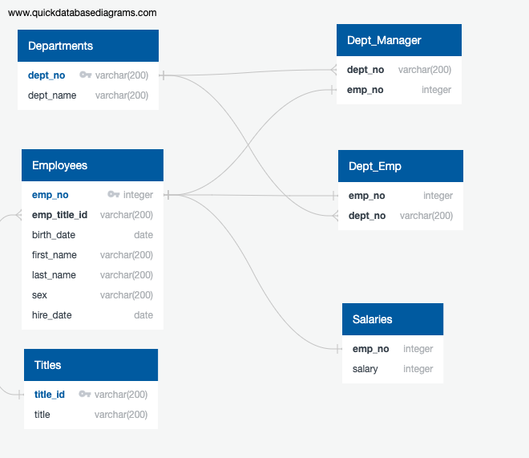
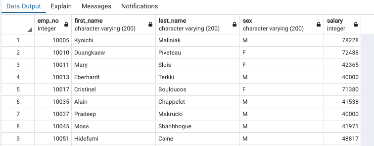
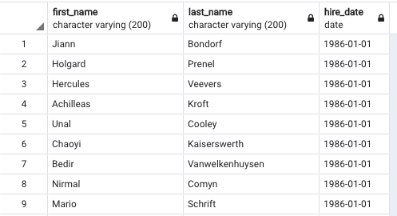
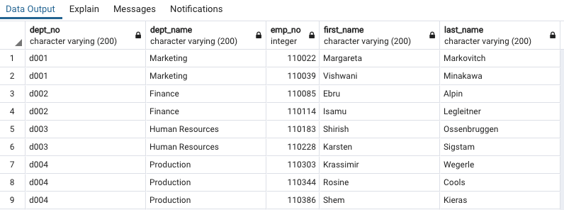
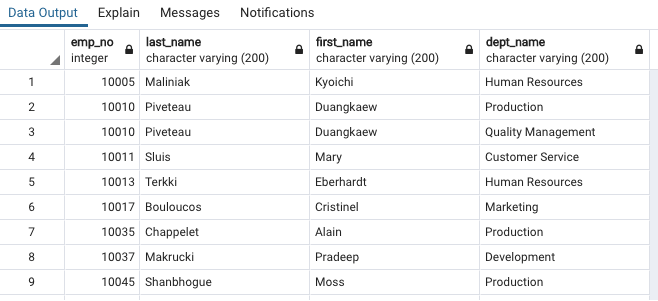
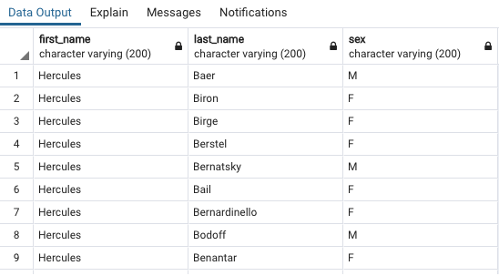
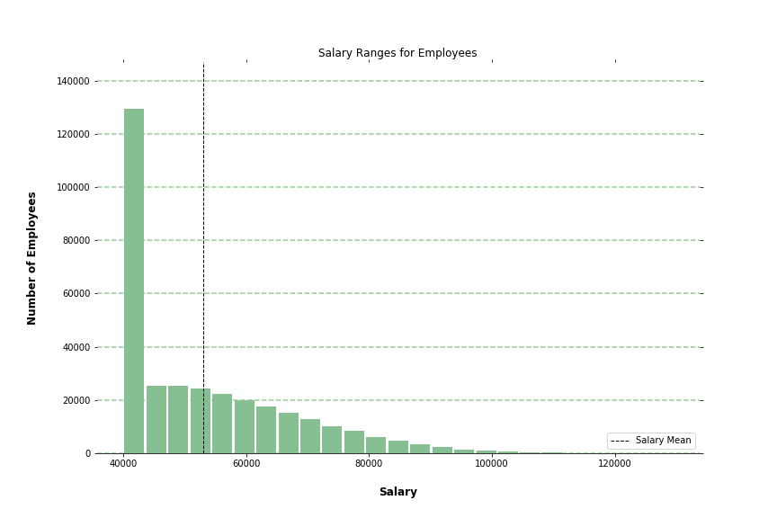
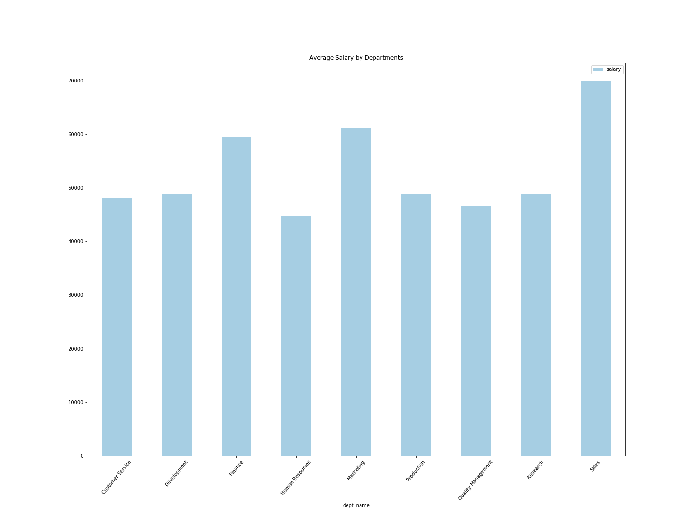

# SQL-Challenge

## Data Modeling
I was hiven 6 different CSV files, which I inspected to find out the relationship between each CSV files and sketchd out an ERD of the tables by using a tool like http://www.quickdatabasediagrams.com.

This is how the schema map looks like, in which I specified data types, primary keys, foreign keys, and other constraints:

## Data Analysis

Once I have a complete database, I did the following:

1. List the following details of each employee: employee number, last name, first name, sex, and salary.

2. List first name, last name, and hire date for employees who were hired in 1986.

3. List the manager of each department with the following information: department number, department name, the manager's employee number, last name, first name.

4. List the department of each employee with the following information: employee number, last name, first name, and department name.

5. List first name, last name, and sex for employees whose first name is "Hercules" and last names begin with "B."

List all employees in the Sales department, including their employee number, last name, first name, and department name.

List all employees in the Sales and Development departments, including their employee number, last name, first name, and department name.

In descending order, list the frequency count of employee last names, i.e., how many employees share each last name.

## Further Analysis

As I examined the data, I wanted to create some graphs in Pandas to better tell the story. I decided to create a histogram to visualize the most common salary ranges for employees.
This is what I found:

Also, I wanted to visualize average salary by title in a bar chart: 

